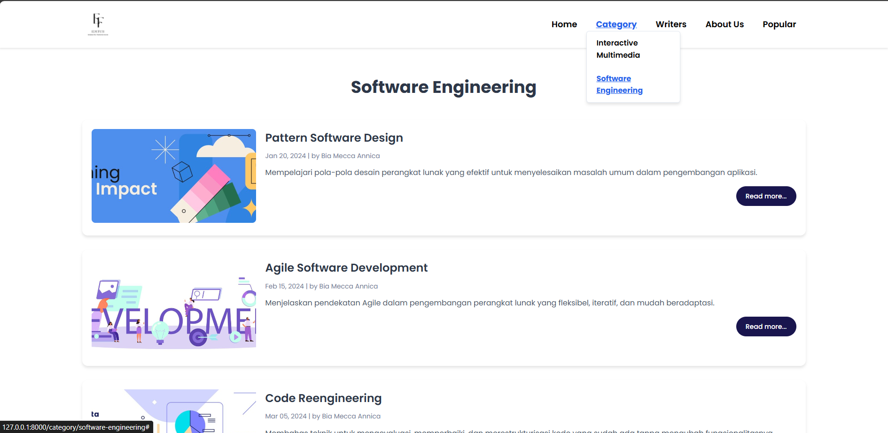
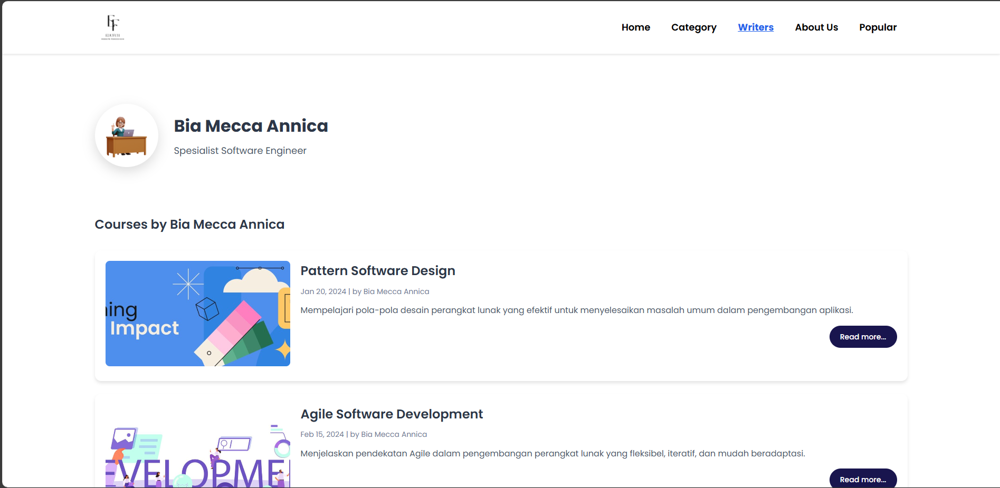

# EduFun - Educational Platform

EduFun adalah platform pembelajaran berbasis web yang menyediakan konten edukasi IT secara gratis untuk mahasiswa dan pelajar Indonesia. Website ini dikembangkan menggunakan Laravel 11 dengan desain responsif dan user-friendly.

## � Screenshots

### 🏠 Home Page


### 📚 Interactive Multimedia Category


### 💻 Software Engineering Category  


### ✍️ Writers Page


### 👤 Writer Detail Page


### ⭐ Popular Courses


### ℹ️ About Us


## �🚀 Features

- **Course Management**: Manajemen kursus Interactive Multimedia dan Software Engineering
- **Writer Profiles**: Profil lengkap para instruktur dan penulis
- **Responsive Design**: Desain yang responsif untuk semua perangkat
- **Indonesian Content**: Konten sepenuhnya dalam bahasa Indonesia
- **Custom CSS**: Styling khusus tanpa framework tambahan
- **SEO Friendly URLs**: URL yang ramah mesin pencari dengan slug

## 🛠️ Tech Stack

- **Framework**: Laravel 11
- **Frontend**: Custom CSS + Blade Templates
- **Database**: File-based data management (DB-major.php)
- **Language**: PHP 8.2+
- **Web Server**: Compatible with Apache/Nginx

## 📦 Installation

1. Clone repository ini
```bash
git clone https://github.com/Keane111/WP-EduFun.git
cd WP-EduFun
```

2. Install dependencies
```bash
composer install
```

3. Copy environment file
```bash
cp .env.example .env
```

4. Generate application key
```bash
php artisan key:generate
```

5. Run the application
```bash
php artisan serve
```

## 📋 Project Structure

- **Controllers**: `app/Http/Controllers/EduController.php`
- **Models**: `app/Models/Course.php`
- **Views**: `resources/views/`
- **Data Source**: `database/seeders/DB-major.php`
- **Styling**: `public/css/app.css`
- **Routes**: `routes/web.php`

## 🎯 Course Categories

### Interactive Multimedia
- Human and Computer Interaction (HCI)
- User Experience (UX)
- UX for Digital Immersive Technology

### Software Engineering
- Pattern Software Design
- Agile Software Development
- Code Reengineering

## 👥 Writers

- **Raka Putra Wicaksono** - Specialist Interactive Multimedia
- **Bia Mecca Annica** - Specialist Software Engineering
- **Abi Firmansyah** - Specialist Network Security

## 🌟 About Laravel

This project is built with Laravel - a web application framework with expressive, elegant syntax. Laravel takes the pain out of development by easing common tasks used in many web projects.

## 📄 License

The Laravel framework is open-sourced software licensed under the [MIT license](https://opensource.org/licenses/MIT).

---

**Developed by**: Keane Richard Christopher | 2702307404  
**Course**: Web Programming | BINUS University
